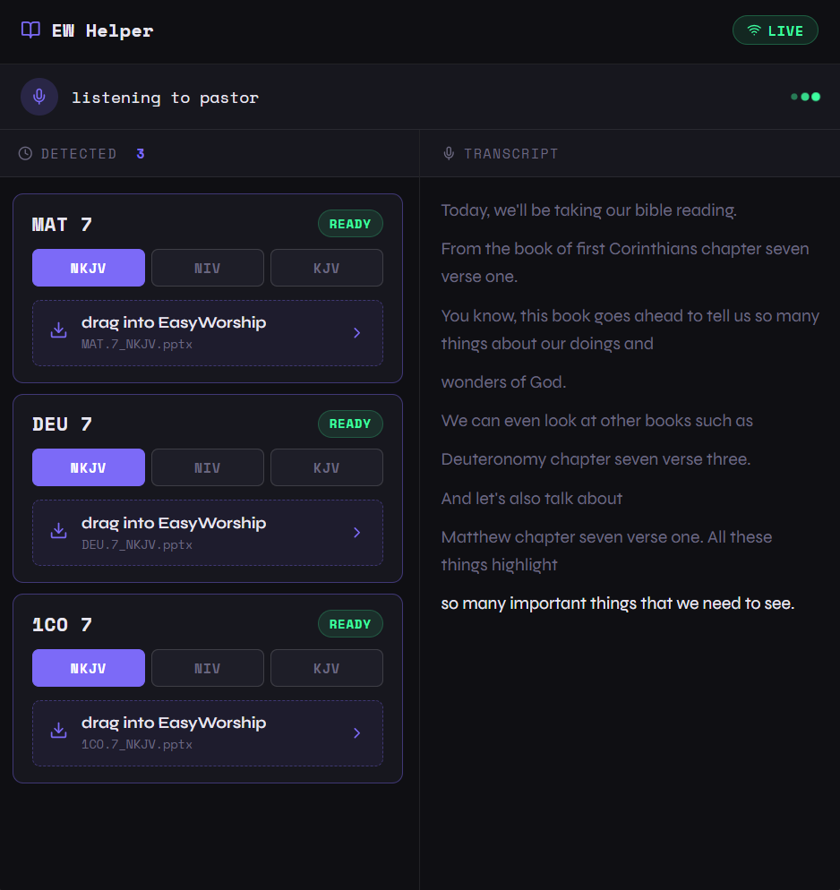
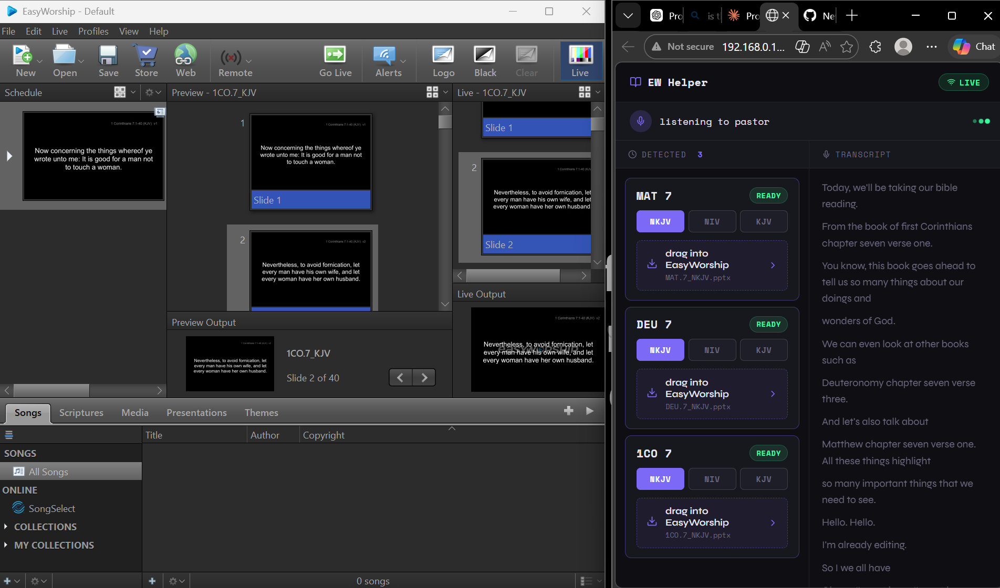

# EasyWorship Helper

A real-time sermon assistant that listens to a pastor speaking, automatically detects Bible references, and generates ready-to-project PowerPoint slides — all before the pastor finishes the sentence.



## What it does

Church projection operators typically scramble to find and load Bible slides mid-sermon. EasyWorship Helper eliminates that entirely.

- Listens to the pastor's microphone in real-time
- Transcribes speech using Deepgram's Nova-2 model
- Sends transcript chunks to Claude AI to detect Bible references — even through speech noise and filler words
- Fetches the detected chapter from the Bible API in **NKJV, NIV, and KJV simultaneously**
- Generates a `.pptx` slide deck for each version with one verse per slide
- Displays the files in a live panel — operator simply **drags the file directly into EasyWorship**

## Demo



> Sermon: *"Let's turn to Deuteronomy chapter seven verse three and also Matthew chapter seven..."*

EasyWorship Helper detects `DEU.7` and `MAT.7`, fetches all three versions in parallel, generates the PowerPoint files, and marks them **READY** — all within seconds.

The operator drags the file directly into EasyWorship. Every verse in the chapter is its own slide — so when the pastor says "verse three", the operator just clicks to slide 3. No searching, no typing, no delay.

> Shown above: 1 Corinthians 7 loaded in EasyWorship (40 slides, one verse each) while the helper panel runs live on the right detecting new references in real time.

## Tech Stack

**Frontend**
- React + Vite
- Socket.io client for real-time updates
- Custom CSS design system

**Backend**
- Python / Flask
- Flask-SocketIO
- Anthropic Claude Haiku — scripture detection from noisy speech
- Deepgram Nova-2 — real-time audio transcription via WebSocket
- Bible API (api.scripture.api.bible) — KJV, NIV, NKJV
- pptxgenjs (via Node subprocess) — PowerPoint generation

## Architecture

```
Microphone → Deepgram WebSocket → Transcript
                                       ↓
                              Claude Haiku (NLP)
                                       ↓
                           Bible API (3 versions, parallel)
                                       ↓
                            pptxgenjs → .pptx files
                                       ↓
                          Socket.io → React UI → EasyWorship
```

## Getting Started

### Prerequisites

- Python 3.10+
- Node.js 18+
- pptxgenjs installed globally

```bash
npm install -g pptxgenjs
```

### Installation

1. Clone the repo

```bash
git clone https://github.com/yourusername/easyworship-scripture-helper
cd easyworship-scripture-helper
```

2. Install Python dependencies

```bash
pip install flask flask-socketio flask-cors anthropic httpx sounddevice python-dotenv
```

3. Install frontend dependencies

```bash
cd frontend
npm install
```

4. Set up environment variables

```bash
cp .env.example .env
```

Fill in your keys in `.env`:

```
DEEPGRAM_API_KEY=your_key_here
ANTHROPIC_API_KEY=your_key_here
BIBLE_API_KEY=your_key_here
```

### Running

Start the backend:

```bash
python server.py
```

Start the frontend:

```bash
cd frontend
npm run dev
```

Open `http://localhost:5173` — the panel will connect automatically when the backend is running.

## Roadmap

- [ ] **Song detection** — detect worship songs from speech and generate matching lyric slide decks
- [ ] **Song search tab** — manually search and load any song as a PowerPoint
- [ ] **Electron app** — package as a standalone desktop app, no browser needed
- [ ] **Verse-level detection** — fetch specific verses instead of whole chapters
- [ ] **Custom slide themes** — let churches use their own branding

## License

MIT
